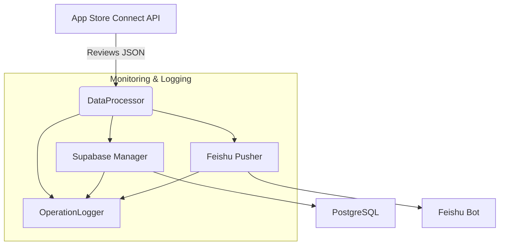

# Protalk App Review Service

> 专为 iOS / macOS App Store 开发者打造的「**自动化评论同步 · 智能推送 · 交互式回复**」解决方案。

---

## 功能总览

| 功能 | 说明 |
| ---- | ---- |
| 评论抓取 | 基于 App Store Connect API，定时增量抓取评论 |
| 数据存储 | PostgreSQL（Supabase 托管）统一结构，支持多语言、多版本 |
| 智能推送 | 飞书卡片 / Webhook 双通道，可过滤、批量、重试 |
| 评论回复 | 支持一键回复、输入校验、结果回传 |
| 监控告警 | Winston ➕ 稳定性指标 ➕ 自定义阈值告警 |
| 全面测试 | 单元 / 集成 / 性能 / 监控 83 + 测试覆盖 |

<details>
<summary>架构图（点击展开）</summary>


</details>

---

## 快速开始

```bash
# 克隆并安装依赖
pnpm i

# 本地运行（需配置 .env）
pnpm dev

# 运行全部测试
pnpm test
```

环境变量一览请参考 `.env.example`，**不要**提交真实密钥。

---

## 统一错误处理 & 日志

- `src/utils/error-handler.ts` ：`getErrorMessage` / `logError`
- `src/utils/operation-logger.ts` ：结构化操作日志（支持步骤 & 批处理）
- 所有核心模块已集成，上层调用无需关心实现。

---

## 测试体系

| 类型 | 位置 | 运行脚本 |
| ---- | ---- | ---- |
| 单元 | `src/test/**/*.test.ts` | `pnpm test src/test` |
| 集成 | `src/test/integration` | `pnpm test src/test/integration` |
| 性能 | `src/test/performance` | `pnpm test src/test/performance` |
| 监控 | `src/test/monitoring`  | `pnpm test src/test/monitoring` |

更多细节见 `docs/TEST_GUIDE.md`。

---

## 监控与告警

| 指标 | 默认阈值 |
| ---- | ---- |
| 同步响应时间 | < 5 s |
| 错误率 | < 50 % |
| 内存增长 | < 10 MB / 10 次操作 |

参阅 `docs/MONITORING_GUIDE.md` 获取 Prometheus / Grafana 集成示例。

---

## 贡献指南

1. **分支策略**：`main` ➕ `feat/*` ➕ `fix/*`
2. **PR 规则**：≤ 400 行 / 对应 Issue / 通过 CI（测试 + lint）
3. **Commit Message**：`feat: xxx` `fix: xxx` ...
4. **文档同步**：若改动公共 API / 架构，必须更新对应文档

---

## 📚 文档导航

### 核心文档
- [PRD 产品需求](docs/PRD.md) - 完整的产品需求和技术架构
- [API 接口文档](docs/api/API.md) - 完整的 API 参考和示例
- [设置指南](docs/guides/SETUP_GUIDE.md) - 从零开始完整设置服务
- [部署指南](docs/deployment/DEPLOYMENT.md) - 生产环境部署

### 测试与监控
- [测试指南](docs/TEST_GUIDE.md) - 测试体系说明
- [错误处理指南](docs/ERROR_HANDLING_GUIDE.md) - 统一错误处理规范
- [监控指南](docs/MONITORING_GUIDE.md) - Prometheus/Grafana 集成

### 故障排查
- [故障排查指南](docs/troubleshooting/README.md) - 常见问题解决
- [JWT 问题修复](docs/troubleshooting/JWT_ISSUES.md) - JWT Token 生成问题
- [飞书连接问题](docs/troubleshooting/FEISHU_CONNECTION_ISSUES.md) - 飞书集成问题

### 实现细节
- [飞书卡片实现](docs/implementation/INTERACTIVE_CARD_IMPLEMENTATION.md) - 交互式卡片开发
- [飞书设置指南](docs/implementation/FEISHU_SETUP_GUIDE.md) - 飞书机器人配置
- [Mock 测试指南](docs/implementation/MOCK_CARD_INTERACTION_GUIDE.md) - 模拟测试环境

### 项目管理
- [文档状态清单](docs/DOCUMENTATION_STATUS.md) - 所有文档的分类和状态
- [项目总结](PROJECT_SUMMARY.md) - 项目功能和架构总结

---

© 2025 Protalk Team
