# 部署指南

## 概述

本指南详细说明如何将 Protalk App Review Service 部署到 Vercel 生产环境。

## 🚀 部署环境

### 生产环境信息
- **平台**: Vercel
- **URL**: `https://protalk-app-review-service-2vq5m5utj-qixu-langs-projects.vercel.app`
- **状态**: ✅ 正常运行
- **版本**: 1.0.0

## 📋 部署前准备

### 1. 环境变量配置

确保在 Vercel 中配置以下环境变量：

```env
# Supabase配置
SUPABASE_URL=https://your-project-ref.supabase.co
SUPABASE_ANON_KEY=your-anon-key-here

# App Store Connect API配置
APP_STORE_ISSUER_ID=your-issuer-id
APP_STORE_KEY_ID=your-key-id
APP_STORE_PRIVATE_KEY=your-private-key

# 飞书配置
FEISHU_APP_ID=your-feishu-app-id
FEISHU_APP_SECRET=your-feishu-app-secret
FEISHU_VERIFICATION_TOKEN=your-verification-token
FEISHU_WEBHOOK_URL=your-webhook-url

# API认证
API_KEY=your-api-key

# 服务器配置
NODE_ENV=production
```

### 2. 构建配置

项目使用以下构建配置：

```json
{
  "version": 2,
  "builds": [
    {
      "src": "dist/index.js",
      "use": "@vercel/node"
    }
  ],
  "routes": [
    {
      "src": "/api/(.*)",
      "dest": "/dist/index.js"
    },
    {
      "src": "/feishu/(.*)",
      "dest": "/dist/index.js"
    },
    {
      "src": "/(.*)",
      "dest": "/dist/index.js"
    }
  ],
  "env": {
    "NODE_ENV": "production"
  }
}
```

## 🔧 部署步骤

### 步骤 1: 安装 Vercel CLI

```bash
npm install -g vercel
```

### 步骤 2: 登录 Vercel

```bash
vercel login
```

### 步骤 3: 构建项目

```bash
# 安装依赖
npm install

# 构建项目
npm run build
```

### 步骤 4: 部署到 Vercel

```bash
# 部署到生产环境
vercel --prod
```

### 步骤 5: 验证部署

```bash
# 健康检查
curl https://your-domain.vercel.app/api/health

# 服务状态
curl https://your-domain.vercel.app/api/status
```

## 📊 部署验证

### 1. 健康检查

```bash
curl https://protalk-app-review-service-2vq5m5utj-qixu-langs-projects.vercel.app/api/health
```

**预期响应**:
```json
{
  "success": true,
  "data": {
    "status": "healthy",
    "timestamp": "2025-08-27T18:43:57.541Z",
    "service": "app-review-service"
  }
}
```

### 2. 服务状态

```bash
curl https://protalk-app-review-service-2vq5m5utj-qixu-langs-projects.vercel.app/api/status
```

**预期响应**:
```json
{
  "success": true,
  "data": {
    "service": "App Review Service",
    "version": "1.0.0",
    "timestamp": "2025-08-27T18:38:51.105Z",
    "uptime": 250.276424801,
    "memory": {
      "rss": 492244992,
      "heapTotal": 217960448,
      "heapUsed": 104088856,
      "external": 13908928,
      "arrayBuffers": 10454202
    },
    "environment": "production"
  }
}
```

### 3. 功能测试

```bash
# 评论同步测试
curl -H "X-API-Key: your_api_key" \
  "https://protalk-app-review-service-2vq5m5utj-qixu-langs-projects.vercel.app/api/sync-reviews?appId=1077776989"
```

## 🔍 监控和维护

### 1. 日志查看

```bash
# 查看 Vercel 日志
vercel logs

# 查看特定函数的日志
vercel logs --function=index
```

### 2. 性能监控

- **响应时间**: 健康检查 < 100ms
- **内存使用**: ~492MB RSS
- **并发处理**: 支持多请求并发
- **错误率**: 0% (正常运行)

### 3. 数据库监控

- **连接状态**: 正常
- **查询性能**: 良好
- **数据量**: 1,000+ 条记录
- **同步状态**: 实时

## 🚨 故障排除

### 常见问题

#### 1. 构建失败

**原因**: TypeScript 编译错误
**解决方案**:
```bash
# 检查编译错误
npm run build

# 修复类型错误
npm run lint:fix
```

#### 2. 环境变量未加载

**原因**: Vercel 环境变量配置错误
**解决方案**:
1. 检查 Vercel 项目设置
2. 重新配置环境变量
3. 重新部署

#### 3. JWT Token 生成失败

**原因**: App Store API 配置错误
**解决方案**: 参考 [JWT问题修复指南](../troubleshooting/JWT_ISSUES.md)

#### 4. 数据库连接失败

**原因**: Supabase 配置错误
**解决方案**:
1. 检查 Supabase URL 和密钥
2. 验证数据库表结构
3. 检查 RLS 策略

### 回滚策略

如果需要回滚到之前的版本：

```bash
# 查看部署历史
vercel ls

# 回滚到指定版本
vercel rollback <deployment-id>
```

## 📈 性能优化

### 1. 构建优化

- 使用 TypeScript 编译优化
- 移除未使用的依赖
- 压缩代码体积

### 2. 运行时优化

- 启用 JWT token 缓存
- 优化数据库查询
- 实现请求限流

### 3. 监控优化

- 启用详细日志记录
- 设置性能监控
- 配置错误告警

## 🔄 持续部署

### 自动化部署

1. **GitHub 集成**: 连接 GitHub 仓库
2. **自动构建**: 提交代码时自动构建
3. **环境验证**: 自动运行测试
4. **生产部署**: 通过后自动部署

### 部署流程

```mermaid
graph LR
    A[代码提交] --> B[自动构建]
    B --> C[运行测试]
    C --> D[部署到生产]
    D --> E[健康检查]
    E --> F[功能验证]
```



## 📞 支持

### 部署问题

如果遇到部署问题：

1. 查看 [Vercel 文档](https://vercel.com/docs)
2. 检查 [项目文档](../../README.md)
3. 查看 [故障排除指南](../troubleshooting/README.md)

### 联系方式

- **项目维护者**: Protalk Team
- **技术支持**: GitHub Issues
- **文档**: 项目 README.md

---

**部署时间**: 2025-08-27  
**版本**: 1.0.0  
**状态**: ✅ 生产就绪
